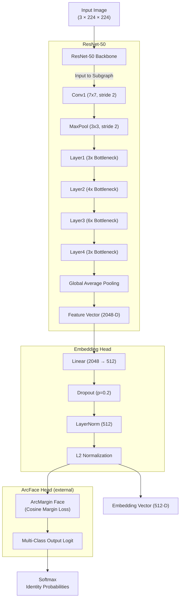

# Task B: Face Verifier

[« Click here to visit the parent repository](../)

[» Click here to see training visualization plots](./visualization/)

## Results

| Phase      | TTA Status | Accuracy | Precision (macro-avg) | Recall (macro-avg) | F1-score (macro-avg) | ROC-AUC score |
|------------|------------|----------|-----------------------|--------------------|----------------------|---------------|
| Train      | Disabled   | 95.43%   | 95.79%                | 95.43%             | 95.42%               | 99.94%        |
| Validation | Disabled   | 85.89%   | 86.00%                | 85.89%             | 85.87%               | 93.20%        |
| Validation | Enabled    | 86.45%   | 86.49%                | 86.45%             | 86.45%               | 93.69%        |

## Architecture

The face verifier is a fine-tuned **ResNet-50** model trained using an [ArcFace](https://arxiv.org/pdf/1801.07698) classifier head that takes an input image of size `(224 × 224)` and outputs an **embedding vector of a fixed dimension** (commonly chosen as 512) representing the identity of the person in the image.

Here is a block diagram of the underlying model architecture using the ResNet-50 backbone:

Similar images are expected to produce embeddings that are close in the vector space, while dissimilar images should yield embeddings that are far apart.

Additionally, to help the model learn discriminative features and generalize features, the following techniques were incorporated into the training pipeline:

- **Gradient Scaling/`autocast()` (When CUDA is enabled):** Enables mixed-precision training using PyTorch's `autocast()` and `GradScaler`, reducing memory usage and speeding up training by using lower precision (e.g., float16) where safe, while maintaining full precision for sensitive operations like gradient calculations.

- **LLRD (Layer-wise Learning Rate Decay):** Applies progressively smaller learning rates to earlier layers (typically pre-trained), allowing newer layers (e.g., the classifier head) to adapt more aggressively, while preserving useful features in earlier layers.

- **Weighted Per-Class Sampling:** Assigns sampling probabilities to each class based on its frequency, ensuring that underrepresented classes are sampled more frequently during training to mitigate class imbalance.

- **ArcFace Head + BCE (Binary Cross-Entropy) Loss:** Combines an ArcFace classification head (which enforces angular margin between classes for better feature separability) with Binary Cross-Entropy Loss, balancing discriminative representation learning with probabilistic classification.

- **Cosine Embedding Loss:** A metric learning loss that encourages similar samples (same class) to have high cosine similarity and dissimilar samples (different classes) to have lower similarity. Useful for learning embeddings where class boundaries are better defined in angular space.

- **Cosine Threshold Sweep:** Involves sweeping across a range of cosine similarity thresholds to determine the optimal cutoff for classification decisions, often improving metrics like precision, recall, or F1 score.

- **One-Cycle Learning Rate Scheduling:** A cyclical learning rate strategy where the learning rate increases rapidly and then decays slowly within a single training cycle, encouraging exploration early and convergence later.

- **Early Stopping Mechanism:** Monitors a validation metric and halts training when performance ceases to improve for a defined number of epochs, reducing overfitting and training time.

- **AdamW Optimizer:** A variant of the Adam optimizer that decouples weight decay from the gradient update, enabling better generalization and improved handling of overfitting through proper [L2 regularization](https://developers.google.com/machine-learning/crash-course/overfitting/regularization).

- **EMA (Exponential Moving Average):** Maintains a moving average of model weights during training, smoothing out fluctuations and often yielding a more robust final model for evaluation or inference.

- **TTA (Test-Time Augmentation):** Applies multiple augmentations (e.g., flips, crops) to each test image and averages the predictions, improving inference robustness and accounting for potential distribution shifts.
