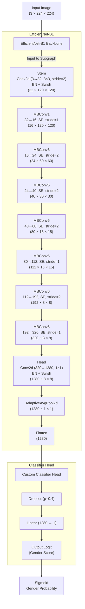

# Task A: Gender Classifier

[« Click here to visit the parent repository](../)

[» Click here to see training visualization plots](./visualization/)

## Results

| Phase      | TTA Status | Accuracy | Precision | Recall | F1-score |
|------------|------------|----------|-----------|--------|----------|
| Train      | Disabled   | 99.01%   | 99.87%    | 98.89% | 99.38%   |
| Validation | Disabled   | 95.73%   | 96.57%    | 97.79% | 97.18%   |
| Validation | Enabled    | 95.73%   | 96.87%    | 97.48% | 97.17%   |

## Architecture

The gender classifier is a fine-tuned **EfficientNet-b1** model that takes an input image of size `(224 × 224)` and outputs either `0` (representing **female**) or `1` (representing **male**).

Here is a block diagram of the underlying model architecture using the EfficientNet-b1 backbone:

Additionally, to help the model generalize and learn discriminative features across each gender, the following techniques were incorporated into the training pipeline:

- **Gradient Scaling/`autocast()` (When CUDA is enabled):** Enables mixed-precision training using PyTorch's `autocast()` and `GradScaler`, reducing memory usage and speeding up training by using lower precision (e.g., float16) where safe, while maintaining full precision for sensitive operations like gradient calculations.

- **LLRD (Layer-wise Learning Rate Decay):** Applies progressively smaller learning rates to earlier layers (typically pre-trained), allowing newer layers (e.g., the classifier head) to adapt more aggressively, while preserving useful features in earlier layers.

- **Weighted Sampler:** Balances class distribution during training by assigning higher sampling probabilities to underrepresented classes, ensuring that each batch contains a more even representation of both genders.

- **Stratified Augmentation:** Applies augmentation strategies tailored to each class, aiming to capture class-specific variability and mitigate imbalances in data representation and quality.

- **Binary Focal Loss:** A loss function that down-weights easy examples and focuses learning on harder, misclassified samples. Particularly effective for imbalanced binary classification tasks.

- **Sigmoid Threshold Sweep:** Involves evaluating performance across a range of sigmoid output thresholds (instead of default 0.5) to select the optimal decision threshold, based on metrics like F1-score.

- **One-Cycle Learning Rate Scheduling:** A cyclical learning rate strategy where the learning rate increases rapidly and then decays slowly within a single training cycle, encouraging exploration early and convergence later.

- **Early Stopping Mechanism:** Monitors a validation metric and halts training when performance ceases to improve for a defined number of epochs, reducing overfitting and training time.

- **AdamW Optimizer:** A variant of the Adam optimizer that decouples weight decay from the gradient update, enabling better generalization and improved handling of overfitting through proper [L2 regularization](https://developers.google.com/machine-learning/crash-course/overfitting/regularization).

- **EMA (Exponential Moving Average):** Maintains a moving average of model weights during training, smoothing out fluctuations and often yielding a more robust final model for evaluation or inference.

- **TTA (Test-Time Augmentation):** Applies multiple augmentations (e.g., flips, crops) to each test image and averages the predictions, improving inference robustness and accounting for potential distribution shifts.
